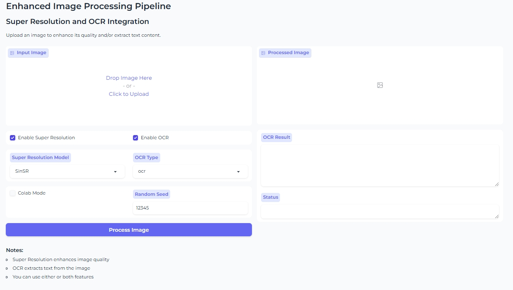

# High Resolution OCR Projects

## 项目简介 / Project Introduction

这是一个代码库，能够同时部署SinSR+OCR模型。它可以将低分辨率的图像转化为高分辨率图像，并在此基础上进行OCR识别，从而实现更广泛的应用场景。  
This is a code repository that deploys the SinSR+OCR model at the same time. It can convert low-resolution images into high-resolution images and then perform OCR recognition on this basis, achieving a wide range of applications.

### 应用场景 / Application Scenarios

- 表单识别  
  Form recognition  
- 票据识别  
  Bill recognition  
- 仪表读数识别  
  Meter reading recognition  
- 车牌识别  
  License plate recognition  
- 手写文字识别  
  Handwriting recognition  
- 公式识别  
  Formula recognition  
- 测试报告识别  
  Test report recognition  

## 安装与启动 / Installation and Startup

1. 安装requirements.txt文件中的依赖：  
   Install dependencies from the `requirements.txt` file:  
   ```bash
   pip install -r requirements.txt
   ```
   
2. 运行 `app.py` 文件，启动应用：  
   Run the `app.py` file to start the application:  
   ```bash
   python app.py
   ```

   执行上述命令后，将会打开一个网页界面，您可以在该界面上传图片并进行处理。  
   After running the above command, a web page will open where you can upload images for processing.

3. 下方为项目的结构图，帮助您更好地理解代码结构和工作流程：  
   Below is a figure link to illustrate the project structure, helping you better understand the code architecture and workflow:  
   

**请注意**: 使用该应用时，请确保已安装所有依赖项，并且图片处理质量可能会因输入图片的分辨率而有所不同。  
**Note**: When using this application, ensure all dependencies are installed, and image processing quality may vary depending on the input image resolution.
